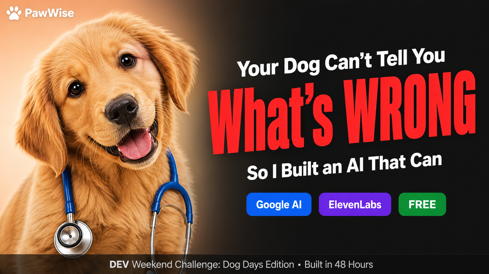

<div align="center">

# 🐾 PawWise

### AI That Actually Understands Your Dog

[](https://simplynadaf.github.io/dog-court)
[](https://www.youtube.com/watch?v=vqyF_65Qc_s)
[](https://dev.to/simplynadaf)
[](LICENSE)

<br/>



<br/>

**59% of dogs are obese and their owners don't know.**<br/>
**60% of serious health issues are caught too late.**<br/>
I built an AI that catches it in a photo.

<br/>

[Live Site →](https://simplynadaf.github.io/dog-court) &nbsp;•&nbsp; [Watch Demo →](https://www.youtube.com/watch?v=vqyF_65Qc_s) &nbsp;•&nbsp; [Read Article →](https://dev.to/simplynadaf)

</div>

---

## 🎬 Demo

<div align="center">

[](https://www.youtube.com/watch?v=vqyF_65Qc_s)

*Click to watch the full demo on YouTube*

</div>

---

## 🎯 What It Does

| Mode | What Happens |
|------|-------------|
| 🏥 **Health Check** | Upload a photo → AI assesses body condition score, coat health, posture, eyes, and flags breed-specific risks |
| 🧠 **Behavior Decoder** | "Why is my dog doing this?" → Breed-specific explanations, whether it's normal, and what to do |
| 🚨 **Emergency Triage** | "My dog ate chocolate" → 🟢🟡🟠🔴 urgency level + first aid + when to rush to the vet |
| ⚖️ **Dog Court** | Upload evidence of destroyed shoes → AI generates a full multi-voice courtroom drama |

---

## 📊 The Problem

| Crisis | Scale |
|--------|-------|
| Dogs overweight/obese | 59-65% in the US |
| Health issues caught too late | 60% (AVMA) |
| Owners can't spot pain | Same accuracy as non-owners (2026 study) |
| Emergency vet panic visits | $653 average, often unnecessary |
| Dogs surrendered to shelters | 28% due to behavior misunderstanding |
| Dogs killed in shelters annually | 359,000+ (2023 peak) |

---

## 🛠️ Tech Stack

```
┌────────────────────────────────────────────────┐
│  Frontend     │  Vanilla HTML/CSS/JS           │
│  AI Engine    │  Google Gemini 3.5 Flash       │
│  Voice        │  ElevenLabs TTS + Dialogue     │
│  Hosting      │  GitHub Pages                  │
│  Dependencies │  Zero. None. Nada.             │
└────────────────────────────────────────────────┘
```

- **Google AI (Gemini 3.5 Flash)** - Multimodal image analysis, structured JSON output, breed-aware health assessment
- **ElevenLabs** - Voice summaries (TTS) + multi-character courtroom drama (Text-to-Dialogue API)
- **Zero dependencies** - No React, no build tools, no node_modules. Pure vanilla. Instant load.

---

## 🚀 Quick Start

```bash
git clone https://github.com/SimplyNadaf/dog-court.git
cd dog-court
npx serve .
# Open http://localhost:3000
```

### API Keys (Free)

| Service | Get Key | Required |
|---------|---------|----------|
| Google AI (Gemini) | [aistudio.google.com/apikey](https://aistudio.google.com/apikey) | ✅ Yes |
| ElevenLabs | [elevenlabs.io/app/settings/api-keys](https://elevenlabs.io/app/settings/api-keys) | Optional (for voice) |

> 🔒 Keys are stored in your browser's localStorage. Never sent to any server. Never logged.

---

## 🔬 How It Works

```
┌──────────────────────────────────────────────────────────┐
│                                                          │
│  📸 User uploads photo + selects mode                    │
│                                                          │
│  ┌─────────────────────────────────────────────────┐     │
│  │  Health Mode                                    │     │
│  │  Photo → Gemini Vision → Body condition,        │     │
│  │  coat, posture, breed risks → Voice summary     │     │
│  └─────────────────────────────────────────────────┘     │
│                                                          │
│  ┌─────────────────────────────────────────────────┐     │
│  │  Emergency Mode                                 │     │
│  │  Description + Photo → Gemini Triage →          │     │
│  │  🟢🟡🟠🔴 Urgency + First aid + When to go     │     │
│  └─────────────────────────────────────────────────┘     │
│                                                          │
│  ┌─────────────────────────────────────────────────┐     │
│  │  Dog Court Mode                                 │     │
│  │  Crime photo → Gemini script → ElevenLabs       │     │
│  │  Text-to-Dialogue → Multi-voice trial audio     │     │
│  └─────────────────────────────────────────────────┘     │
│                                                          │
└──────────────────────────────────────────────────────────┘
```

---

## 🏆 Built For

**[DEV Weekend Challenge: Dog Days Edition](https://dev.to/challenges/weekend-2026-08-13)**

Prize categories targeted:
- ✅ **Best Use of Google AI** - Gemini multimodal vision + structured JSON health triage
- ✅ **Best Use of ElevenLabs** - Voice summaries + multi-character courtroom drama

---

## 📁 Project Structure

```
dog-court/
├── index.html          # Single-page app
├── style.css           # Premium UI (warm cream, glass, spring animations)
├── app.js              # All logic (Gemini + ElevenLabs integration)
├── img/
│   ├── banner.png      # Project banner
│   ├── hero.png        # Hero section image
│   ├── icon-health.png
│   ├── icon-behavior.png
│   ├── icon-emergency.png
│   └── icon-court.png
└── .github/
    └── workflows/
        └── deploy.yml  # Auto-deploy to GitHub Pages
```

---

## ⚠️ Disclaimer

PawWise is an AI tool, not a veterinarian. It's designed to help you make better decisions about your dog's health - not replace professional veterinary care. When in doubt, always see your vet.

---

## 👨‍💻 Author

<div align="center">

**Sarvar Nadaf**

Cloud Architect • 10+ years in Cloud & IT • 7x AWS Certified • AWS Community Builder

[](https://dev.to/simplynadaf)
[](https://www.youtube.com/@TechwithSarvar)
[](https://github.com/simplynadaf)
[](https://sarvarnadaf.com)
[](mailto:simplynadaf@gmail.com)

</div>

---

## 📄 License

MIT - Because good tools should be accessible to everyone.

---

<div align="center">

**Because no dog should suffer in silence while their owner thinks everything is fine.**

<br/>

⭐ If this helped you, give it a star!

[](https://github.com/simplynadaf/dog-court)

</div>
